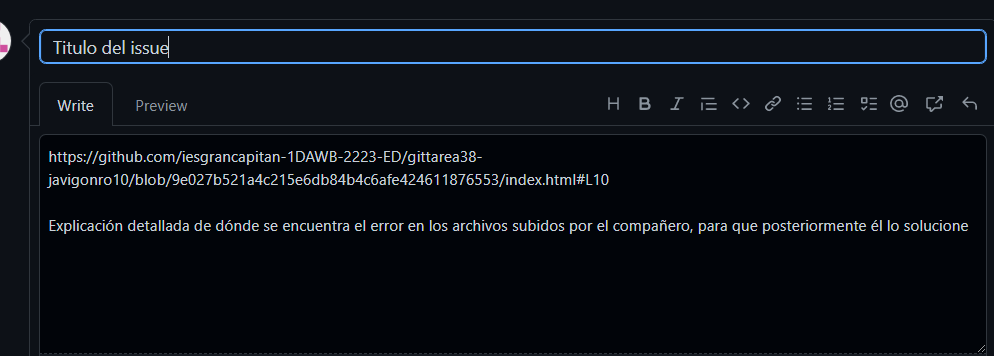

# Tarea Git 3.8: Git. Issues

Para esto nuestro compañero subirá un archivo y nosotros accederemos a su repo para posteriormente darle al botón de "Blame" seleccionar la línea y posteriormente generar una "issue" referenciando la línea que habíamos hecho para que posteriormente él la arregle

Podemos aplicarle un label a los issues para saber que temas tratan, ya sea un bug, una documentación, etc. para ello accederemos a nuestros issues lo seleccionaremos y le aplicaremos el label conveniente

Para resolverlos iremos a nuestro directorio local clonaremos el repo en el que existe esa incidencia y ejecutaremos un comit que IMPORTANTE contenga una de las palabras claves para ceerrar las incidencias (en mi caso usaré "close") y seguido de #NUM donde NUM es el numero de incidencia que queremos cerrar, podemos cerrar tantas como queramos

Como podemos ver después de ejecutar el comando, la incidencia está cerrada correctamente, con las modificaciones que hayamos realizado previamente para solucionar esas incidencias

